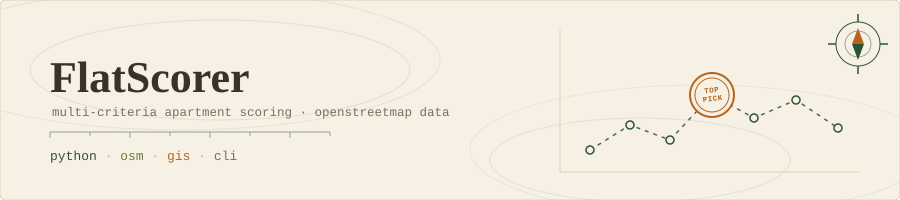
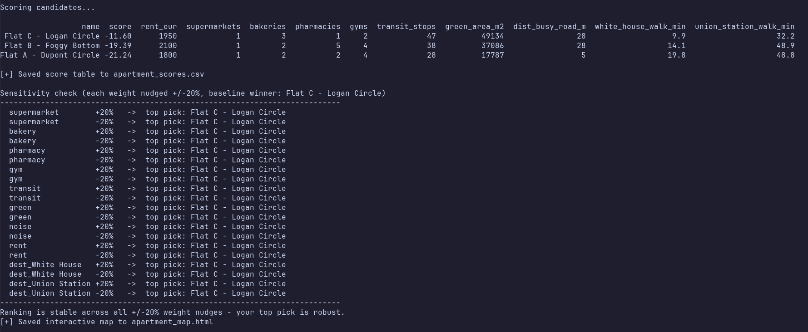
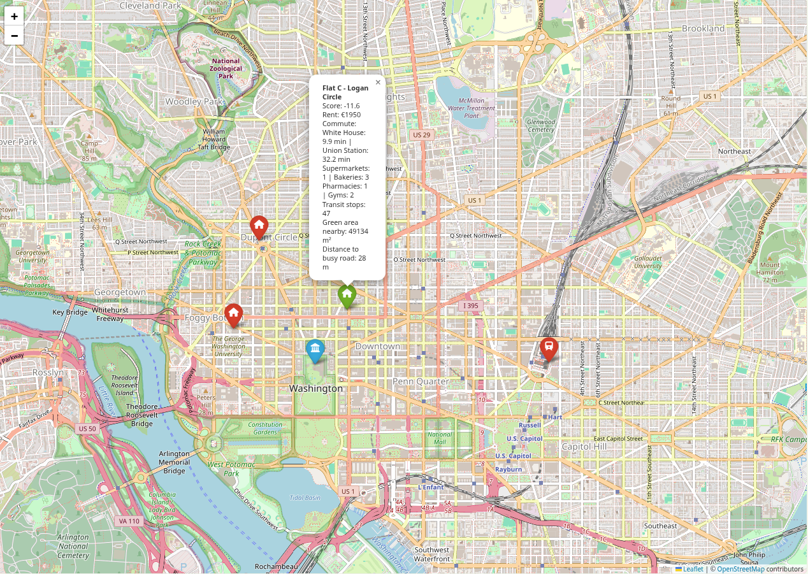
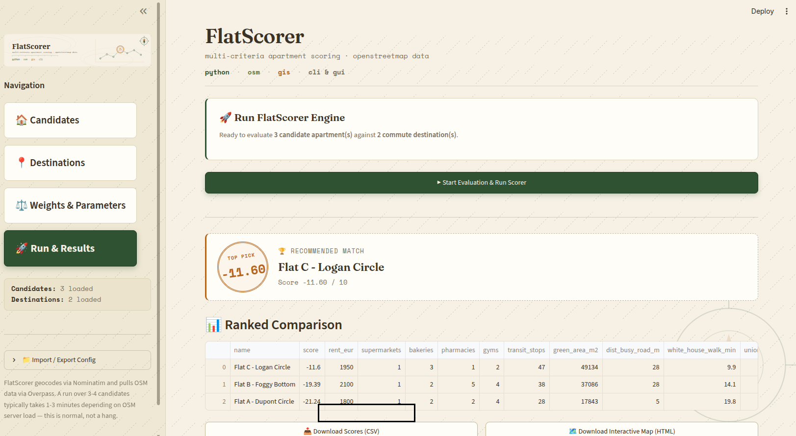

<p align="center">
  
</p>

<p align="center">
  <strong>Score and compare apartments using real OpenStreetMap data.</strong><br>
  Amenities, transit, green space, commute times, rent — all in one weighted score.
</p>

<p align="center">
  <a href="#quick-start">Quick Start</a> ·
  <a href="#gui">GUI</a> ·
  <a href="#how-it-works">How It Works</a> ·
  <a href="#configuration">Configuration</a> ·
  <a href="#cli-reference">CLI Reference</a>
</p>

<p align="center">
  <a href="https://github.com/Aduneer/FlatScorer/actions/workflows/ci.yml"></a>
  <a href="LICENSE"></a>
  
</p>

---

## What is this?

FlatScorer is a command-line Python tool that helps you objectively compare
apartments (or any set of candidate addresses) by pulling spatial data from
OpenStreetMap and computing a composite livability score.

You define your candidate flats, the places you care about getting to (office,
university, train station, ...), and how much you value each criterion. The tool
handles the rest — geocoding, network routing, amenity counting — and gives you
a ranked table, a CSV, an interactive HTML map, and a sensitivity analysis that
tells you whether your ranking is robust or hinges on a single weight choice.

**Works anywhere in the world** — CRS is auto-detected from your coordinates.

## Preview

| Terminal output | Interactive map |
|---|---|
|  |  |

## Quick Start

```bash
# Clone and install dependencies
git clone https://github.com/Aduneer/FlatScorer.git
cd FlatScorer
pip install -r requirements.txt

# Generate a starter config with demo data
python FlatScorer.py --generate-config config.json

# Edit config.json with your own addresses, then run
python FlatScorer.py --config config.json
```

Running without `--config` uses built-in demo data (Washington, DC) so you can
try it immediately.

## GUI

Prefer a form over JSON? There's a Streamlit interface that wraps the same
scoring engine — build your candidate list and destinations in a table,
tune weights with sliders, and get the ranked table and interactive map
right in your browser.

```bash
pip install -r requirements-gui.txt
streamlit run streamlit_app.py
```

It reuses `FlatScorer.py` directly, so results are identical to the CLI —
this is just a friendlier way to build the config and view the output.

<p align="center">
  
</p>

## How It Works

For each candidate apartment, FlatSearcher:

1. **Geocodes** all addresses via Nominatim (through OSMnx).
2. **Downloads** the walking street network and points of interest for the
   bounding region from the Overpass API (with automatic mirror failover).
3. **Counts nearby amenities** within a configurable radius (default 500 m):
   supermarkets, bakeries, pharmacies, gyms, bus/tram stops.
4. **Measures green space** — park and forest polygon area plus point features.
5. **Estimates noise exposure** via distance to the nearest primary/secondary road.
6. **Routes walking commutes** to each of your defined destinations over the
   real pedestrian network (~5 km/h).
7. **Converts rent** into a time-equivalent penalty so it can be compared
   against commute minutes on the same scale.
8. **Computes a weighted score** from all of the above.

### Output

| Artifact | Description |
|---|---|
| Terminal table | Ranked summary printed to stdout |
| `apartment_scores.csv` | Full metrics for every candidate |
| `apartment_map.html` | Interactive Folium map with color-coded pins |
| Sensitivity report | ±20% weight perturbation check on ranking stability |

## Configuration

Everything is driven by a single JSON file. Generate a template with
`--generate-config`, then edit it.

```jsonc
{
  // Apartments to compare
  "candidates": [
    {
      "name": "Flat A - Kreuzberg",
      "address": "Oranienstraße 1, 10999 Berlin, Germany",
      "rent": 1200
    }
  ],

  // Places you commute to — each gets a walking-time column
  "destinations": {
    "Office": {
      "address": "Alexanderplatz 1, 10178 Berlin, Germany",
      "weight": 0.20,        // importance in the score
      "icon": "briefcase",   // FontAwesome icon on the map
      "color": "blue"
    }
  },

  // How much each factor matters (higher = more important)
  "weights": {
    "supermarket": 0.30,
    "bakery":      0.10,
    "pharmacy":    0.15,
    "gym":         0.15,
    "transit":     0.33,
    "green":       0.05,
    "noise":       0.05,
    "rent":        0.25
  },

  "parameters": {
    "euros_per_extra_minute": 20,  // rent-to-time tradeoff (€20 ≈ 1 min)
    "buffer_m": 500,               // amenity search radius in meters
    "noise_cap_m": 200,            // noise benefit caps at this distance
    "projected_crs": "auto"        // auto-detect UTM zone, or e.g. "EPSG:25832"
  },

  "output": {
    "csv_file": "apartment_scores.csv",
    "html_file": "apartment_map.html"
  }
}
```

### Key parameters explained

- **`euros_per_extra_minute`** — The rent/commute tradeoff ratio. A value of 20
  means "€100/month cheaper rent is worth about 5 minutes extra walk each way."
  Increase if rent matters more to you; decrease if commute does.

- **`projected_crs`** — Coordinate reference system for metric distance
  calculations. `"auto"` picks the correct UTM zone for your region. Override
  with an EPSG code if you have a preference.

- **Destination `weight`** — Controls how heavily each destination's walking
  time penalises the score. A weight of 0.15 on a 40-minute walk subtracts 6
  points; at 0.30 it would subtract 12.

## CLI Reference

```
usage: FlatScorer.py [-h] [-c CONFIG] [--generate-config FILE]
                       [--csv FILE] [--html FILE] [-q]

options:
  -c, --config PATH            JSON configuration file
  --generate-config PATH       Write a starter config and exit
  --csv PATH                   Override CSV output path
  --html PATH                  Override HTML map output path
  -q, --quiet                  Suppress progress logs
```

## Requirements

- Python 3.9+
- Dependencies: `osmnx`, `networkx`, `geopandas`, `pandas`, `folium`,
  `shapely`, `requests`

Install everything with:

```bash
pip install -r requirements.txt
```

## Overpass API Resilience

The Overpass API (used for OSM data) can be flaky. FlatSearcher automatically
retries failed requests and rotates through three public mirrors:

- `overpass-api.de`
- `overpass.kumi.systems`
- `overpass.private.coffee`

If all mirrors fail, check your internet connection or try again later — the
OSM infrastructure occasionally has outages.

## Data & Attribution

FlatSearcher runs on free, community-maintained OpenStreetMap infrastructure:

- Map, amenity, and road data: © [OpenStreetMap](https://www.openstreetmap.org/copyright)
  contributors, [ODbL](https://opendatacommons.org/licenses/odbl/).
- Geocoding via [Nominatim](https://nominatim.org/), subject to its
  [usage policy](https://operations.osmfoundation.org/policies/nominatim/) (max 1
  request/sec, no bulk geocoding). FlatScorer's per-run usage stays well within
  this, but don't script it into a batch job over hundreds of addresses.
- POI and network data via the [Overpass API](https://wiki.openstreetmap.org/wiki/Overpass_API),
  through the public mirrors listed below, each with their own fair-use rules.
  Be a good citizen — keep bounding boxes to what you actually need.

## License

MIT — see [LICENSE](LICENSE).
